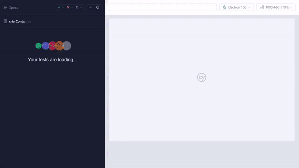

# cypress-automacao
<h2>Instruções para testar a automação do Projeto Getz (Cypress)</h2>

### Para configurar o Ambiente:
<ol>
<li>Instalar [Node.js](https://nodejs.org/en/). </li>
<li>Instalar o Cypress: <i>$npm install cypress</i></li>
<li>Instalar o Faker: <i>$npm install @faker-js/faker --save-dev</i></li>
<li>Instalar o Faker - Br: <i>$npm install faker-br</i></li>
</ol>

### iniciando os testes:
<b>execute o seguinte comando no terminal<b>
<ul>
<li><i>$npx cypress open</i></li>  

### Abrindo o Cypress
<li>Entre na opção 'E2E Testing'</li>
<li>Escolha Chrome ou outro navegador de sua prefêrencia para executar a automação. <i>Clica em 'Start E2E Testing in'</i></li>
<li>Escolha entre os dois testes automatizados para executa-los</li>
 

### Demostrações:
<li>Automação de Cadastro:
</li>
 
<li>Automação de Realizar Pedidos:
</li>

</ul>
